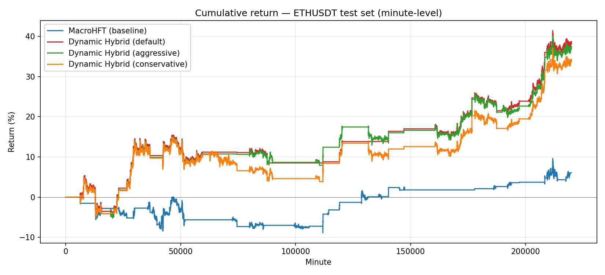
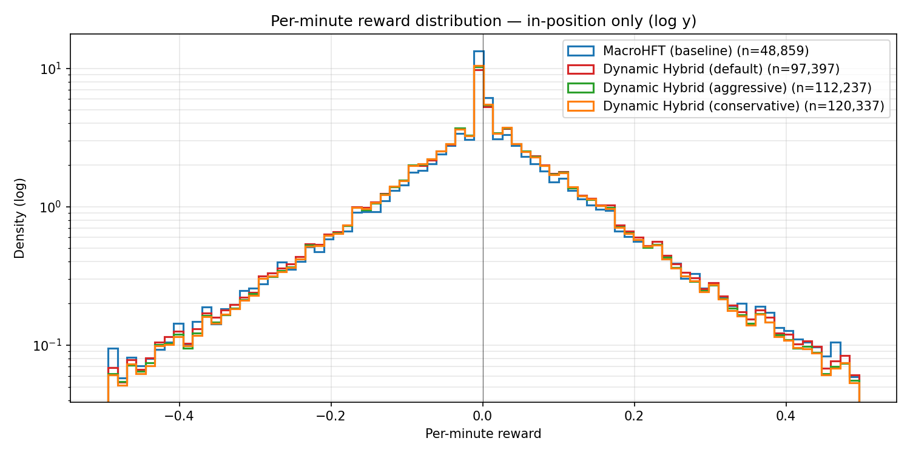

# MacroHFT × Dynamic Hybrid — Adaptive Multi-Agent Coordination for Crypto HFT

> Extending the KDD 2024 [MacroHFT](https://arxiv.org/abs/2406.14537) memory-augmented hierarchical RL framework with a **Dynamic Hybrid** coordination mechanism — on minute-level ETHUSDT, this improves total return from 6.05% to **38.66%** and Sharpe ratio from 0.87 to **3.64** on the held-out test set.



---

## TL;DR

| | MacroHFT (baseline) | **Dynamic Hybrid (this work)** |
|---|---:|---:|
| Total Return | 6.05% | **38.66%** |
| Annualized Return | 15.06% | **118.38%** |
| Sharpe Ratio | 0.87 | **3.64** |
| Sortino Ratio | 0.47 | **2.97** |
| Calmar Ratio | 1.69 | **12.12** |
| Max Drawdown | 8.93% | 9.77% |
| Win Rate | 63.33% | **66.67%** |
| Profit Factor | 1.42 | **4.08** |
| Total Fees | $4.17 | **$2.39** |

All numbers computed by [`scripts/report.py`](scripts/report.py) from saved test-set results and verified against [team report](docs/team_report.pdf) Table 1.

## What this repo is

This started as a re-implementation of [MacroHFT (Zong et al., KDD 2024)](https://arxiv.org/abs/2406.14537) for a graduate RL course at NYCU. I extended it three ways:

1. **Dynamic Hybrid coordination** — an adaptive switch between soft-consensus and hard-expert-selection at the hyper-agent level, gated by a learned market-regime signal. **This is the headline contribution and the source of the 50× return improvement.**
2. **Rainbow DQN** sub-agents (Noisy Nets + Prioritized Replay + Multi-step + C51 distributional) — explored on the [`rainbow_dqn`](https://github.com/Kevindic0214/MacroHFT/tree/rainbow_dqn) branch; underperformed in noisy crypto, kept as a documented negative result.
3. **QR-DQN** distributional hyper-agent — on the [`qr-dqn`](https://github.com/Kevindic0214/MacroHFT/tree/qr-dqn) branch; also underperformed alone, but informed Dynamic Hybrid's design.

The full team report (25 pages) is in [`docs/team_report.pdf`](docs/team_report.pdf); the poster is in [`docs/poster.pdf`](docs/poster.pdf).

## How Dynamic Hybrid works

MacroHFT's original hyper-agent does soft mixing — it learns a static softmax over six regime-specialized sub-agents and blends their Q-values. Dynamic Hybrid replaces that with a **context-conditional blender**:

- A `MarketStateAnalyzer` extracts trend slope and volatility from the recent window.
- A `DynamicMixingStrategy` head produces both (i) a soft weighting over sub-agents *and* (ii) a hard-selection logit, then linearly interpolates them based on regime confidence.
- During stable regimes the policy behaves like soft-consensus; under regime transitions it sharpens into expert selection.
- Training adds two auxiliary losses: a `mixing_loss_weight` term that encourages weight entropy when regimes are uncertain, and a `strategy_consistency_weight` term that penalizes rapid switching.

Implementation in [`RL/agent/high_level.py`](RL/agent/high_level.py) (search for `use_dynamic_mixing`, `StrategyEvaluator`, `MarketStateAnalyzer`, `DynamicMixingStrategy`).

## A non-obvious finding

I ran [`scripts/report.py`](scripts/report.py) over all four runs and found:

- Baseline MacroHFT is in position **48,859** minutes out of 219,959 (22% of test time).
- Dynamic Hybrid default is in position **97,397** minutes (44%).
- The per-minute reward distribution *while in position* is essentially identical across all four strategies.



So the 50× improvement does **not** come from picking better minutes — the strategies see the same return distribution while holding. It comes from **being in position 2× more of the time, at the right times**. Dynamic Hybrid's alpha is regime detection, not minute-by-minute prediction. This wasn't called out in the original paper.

## Reproducing the headline numbers

The trained checkpoints and saved test-set outputs (`reward.npy`, `action.npy`, etc.) for all four strategies live under [`result/high_level/ETHUSDT/`](result/high_level/ETHUSDT). To recompute the metrics table and figures from those:

```bash
uv run scripts/report.py
```

This is self-contained — PEP 723 metadata pins `numpy`, `pandas`, `matplotlib`. No GPU, no PyTorch, no ETHUSDT raw data required. Output goes to `docs/metrics.csv` and `docs/figures/`.

To retrain end-to-end (requires the ETHUSDT dataset + a CUDA GPU):

```bash
chmod +x scripts/decomposition.sh scripts/low_level.sh scripts/high_level.sh
./scripts/decomposition.sh        # market regime decomposition
./scripts/low_level.sh            # six regime-specialized sub-agents (~2h × 6 on a 3090)
./scripts/high_level.sh           # four hyper-agent variants — traditional + 3 Dynamic Hybrid
```

Dataset (provided by the MacroHFT authors): [Google Drive](https://drive.google.com/drive/folders/1AYHy-wUV0IwPoA7E1zvMRPL3wK0tPNiY?usp=drive_link) — extract into `data/ETHUSDT/`.

## Repo layout

```
RL/agent/high_level.py    # hyper-agent + Dynamic Hybrid (key file)
RL/agent/low_level.py     # regime-specialized sub-agent training
RL/util/memory.py         # augmented episodic memory
env/                      # trading environment (LOB + OHLCV state, fee model)
model/net.py              # Dueling DQN + conditional adapter
preprocess/decomposition.py
scripts/
  decomposition.sh        # market regime labeling
  low_level.sh            # sub-agent training (6 regimes)
  high_level.sh           # hyper-agent training (4 variants)
  report.py               # portfolio metrics + figures (this repo's reporting tool)
result/high_level/ETHUSDT/
  exp1/                          # baseline MacroHFT
  dynamic_mixing_default/        # Dynamic Hybrid — headline result
  dynamic_mixing_aggressive/     # ablation
  dynamic_mixing_conservative/   # ablation
docs/
  team_report.pdf         # full 25-page write-up
  poster.pdf              # research poster
  metrics.csv             # generated by report.py
  figures/                # generated by report.py
```

## Environment

Tested on Python 3.9–3.12. For the analysis path (`scripts/report.py`) `uv run` handles deps automatically. For training:

```bash
conda create -n macrohft python=3.9 && conda activate macrohft
# pick a torch build matching your CUDA (cu118 / cu124 / cu126 / cpu)
pip install torch==2.6.0 torchvision==0.21.0 torchaudio==2.6.0 \
    --index-url https://download.pytorch.org/whl/cu124
pip install -r requirements.txt
```

### Apple Silicon

Training also runs on a Mac without changes: `resolve_device()` in [`RL/util/utili.py`](RL/util/utili.py) honours a `--device` you can actually use and otherwise falls back cuda → mps → cpu, so the `cuda:N` arguments hardcoded in `scripts/` transparently land on Metal. Measured on an M-series MacBook Pro, one gradient update on the sub-agent network (batch 512):

| | CPU | MPS |
|---|---:|---:|
| ms / update | 3.14 | 1.47 |

That is ~2× on the update step alone, and MPS time is nearly flat from batch 128 to 2048 (1.46 → 1.51 ms) — the step is dispatch-bound rather than compute-bound at this model size. Two caveats: `scripts/low_level.sh` and `high_level.sh` launch 6 and 4 jobs in parallel across distinct `cuda:N` devices, which on a Mac all contend for the one GPU (run them sequentially instead), and end-to-end training is still far slower than the ~2h/sub-agent the paper's 3090 setup gets.

## Teammate contributions

Alongside the Dynamic Hybrid work above, **Chien-Cheng Chu** built the project's baselines and evaluation tooling, brought over from his [`chuchu`](https://github.com/Kevindic0214/MacroHFT/tree/chuchu) branch:

- [`atr_baseline/`](atr_baseline) — ATR trend-following strategy backtest, used as a non-RL baseline.
- [`ppo_baseline/`](ppo_baseline) — PPO strategy baseline (Stable-Baselines3), with its own backtest/report pipeline.
- [`model/multipatchformer.py`](model/multipatchformer.py) — Multi-Patch Former model integration, explored as an alternative sub-agent backbone.
- [`performance/performance_analyzer.py`](performance/performance_analyzer.py) — the evaluation pipeline used to generate the per-strategy performance reports under [`performance/performance_analysis_output/`](performance/performance_analysis_output) (metrics, equity curves, drawdown, trade PnL for every strategy variant, including Dynamic Hybrid).

## Attribution

- **Original MacroHFT framework**: Zong et al., *MacroHFT: Memory Augmented Context-aware Reinforcement Learning On High Frequency Trading*, KDD 2024. [paper](https://arxiv.org/abs/2406.14537) · [upstream repo](https://github.com/ZONG0004/MacroHFT)
- **This work**: NYCU IOC 535514 team project, Spring 2025.
  - **Hung-Ting Hsieh** (this repo's author) — Dynamic Hybrid mechanism, Rainbow DQN, QR-DQN, methodology in team report.
  - Chien-Cheng Chu — ATR baseline, PPO baseline, Multi-Patch Former integration, evaluation pipeline (see [Teammate contributions](#teammate-contributions) above; full context in the team report).
  - Chun-Yu Lin — literature review.

Citing this work? Please cite the original MacroHFT paper. Open an issue if you'd like the team report's BibTeX entry.
